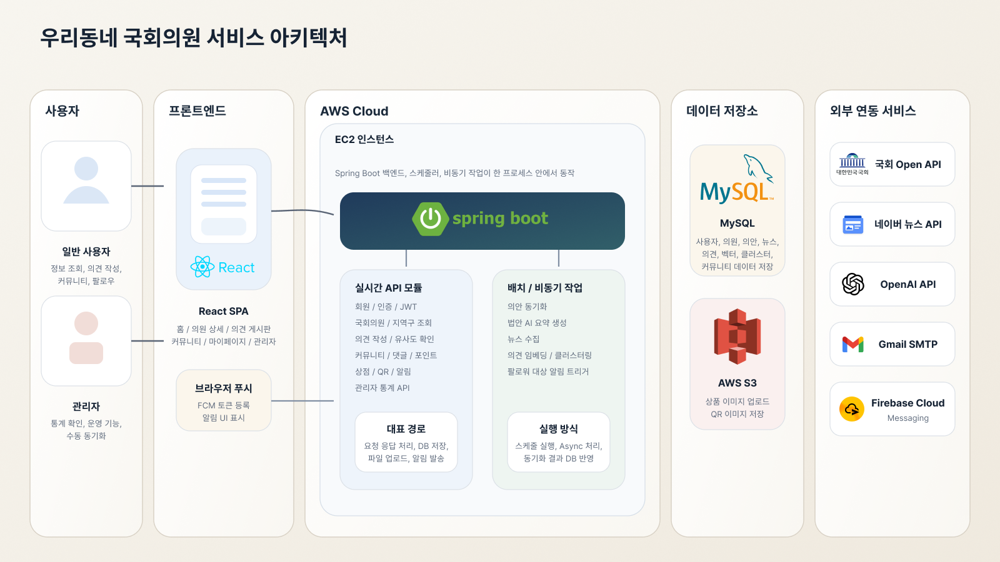

# 우리동네 국회의원

> 내 지역구 국회의원을 찾고, 주민 의견을 직접 전달하며, 관련 의정 활동까지 연결해서 확인할 수 있는 지역 기반 정치 참여 플랫폼

  
  
  

## 프로젝트 소개

| 항목 | 내용 |
| --- | --- |
| 한 줄 소개 | 시민이 내 지역구 국회의원을 찾고, 의견을 남기고, 관련 의정 활동을 함께 확인할 수 있도록 만든 정치 참여 서비스 |
| 해결하려는 문제 | 정치 관심은 높아지고 있지만, 시민이 지역구 국회의원에게 의견을 전달하고 반영 흐름을 체감할 수 있는 창구는 여전히 부족합니다. |
| 핵심 가치 | `접근성 있는 소통` `민심 데이터화` `의정 활동 연결` |
| 프로젝트 형태 | 3인 팀 프로젝트 |

## 왜 이 서비스를 만들었나

- 시민의 정치 관심은 높아지고 있지만, 실제로 참여할 수 있는 방식은 여전히 제한적입니다.
- 특히 지역 단위에서는 내가 사는 동네의 문제를 어떤 의원에게, 어떤 방식으로 전달해야 하는지 알기 어렵습니다.
- 전달 이후에도 내 의견이 다른 주민 의견과 어떻게 연결되는지, 실제 정치 과정과 어떤 관계가 있는지 확인하기 어렵습니다.
- 2024년 3월 19일 공개된 한국행정연구원 `2023년 사회통합실태조사`에 따르면, 국회와 국민 간 소통 인식은 4점 만점에 2.0점으로 낮게 나타났습니다. [관련 기사 보기](https://www.segye.com/newsView/20240319516705)

우리동네 국회의원은 이 간극을 줄이기 위해 기획했습니다.  
시민은 내 지역구 의원을 쉽게 찾고 의견을 남길 수 있고, 의원 관련 뉴스·법안·답변 정보를 함께 확인하면서 단순 민원 제출을 넘어 실제 정치 참여 경험으로 이어지도록 설계했습니다.

## 서비스 목표

- 시민이 지역 현안과 불편사항을 쉽고 빠르게 작성하고 전달할 수 있는 온라인 소통 창구를 제공합니다.
- 개별 의견을 단순 저장에 그치지 않고, 유사 의견을 분류·집계해 민심을 데이터로 확인할 수 있게 만듭니다.
- 주민 의견과 의원의 발의안, 뉴스, 답변 흐름을 연결해 정치 과정과의 접점을 더 명확하게 보여줍니다.

## 핵심 기능

| 기능 | 설명 | 구현 포인트 |
| --- | --- | --- |
| 지역구·이름 기반 의원 탐색 | 주소 또는 이름으로 내 지역구 국회의원을 빠르게 찾을 수 있습니다. | 행정구역-선거구 매핑, 자동완성 검색 |
| 국회의원 상세 정보 조회 | 의원 프로필, 소속 위원회, 대표/공동 발의 법안, 관련 뉴스를 한 화면에서 확인할 수 있습니다. | 국회 Open API 연동, 의안/뉴스 데이터 수집 |
| 주민 의견 작성 및 답변 확인 | 시민이 의원에게 의견을 등록하고, 답변 상태와 결과를 확인할 수 있습니다. | JWT 기반 인증, 의견/답변 CRUD |
| 유사 의견 검사 및 군집화 | 비슷한 의견을 자동으로 묶어 대표 주제로 요약하고, 중복성 높은 민원을 구조화합니다. | OpenAI Embedding, SMILE K-Means, LLM 요약 |
| 팔로우 기반 소식 알림 | 관심 있는 의원을 팔로우하면 관련 뉴스와 새 법안 소식을 알림으로 받을 수 있습니다. | Firebase Cloud Messaging, 알림 저장/조회 |

### 참여를 이어주는 보조 기능

- 지역 주민 커뮤니티에서 지역 현안 관련 글을 작성하고 소통할 수 있습니다.
- 마이페이지에서 내가 남긴 글, 댓글, 팔로우, 포인트/구매 내역을 확인할 수 있습니다.
- 관리자 페이지에서 커뮤니티, 회원, 포인트, 의견 현황을 모니터링할 수 있습니다.

## 기술적 포인트

### 1. 주소를 지역구 의원 탐색으로 연결

행정구역 데이터와 선거구 정보를 연결해, 사용자가 `내 주소` 기준으로 지역구 국회의원을 찾을 수 있도록 구성했습니다.

### 2. 민원을 AI로 묶어 "읽을 수 있는 민심 데이터"로 변환

의견 등록 시 임베딩을 생성하고, 일정 수 이상 누적되면 K-Means 기반 군집화를 수행합니다.  
그 뒤 대표 의견을 바탕으로 클러스터 제목과 요약 문구를 생성해, 개별 민원을 단순 나열하는 대신 주제 단위로 읽을 수 있도록 만들었습니다.

### 3. 의견과 의정 활동을 한 흐름에서 확인

국회의원 상세 페이지에서 발의 법안과 관련 뉴스, 의견 게시판을 함께 보여주고, 팔로우 사용자는 새 법안·뉴스 알림을 받을 수 있게 구성했습니다.

### 4. 법안 정보를 시민 친화적으로 요약

국회 의안 원문을 그대로 보여주는 대신, 요약 생성 로직을 통해 시민이 빠르게 이해할 수 있는 형태로 재가공했습니다.

## 기대 효과

| 관점 | 기대 효과 |
| --- | --- |
| 시민 | 지역구 의원의 활동을 더 쉽게 파악하고, 의견 전달을 통해 실질적인 정치 참여 경험을 얻을 수 있습니다. |
| 국회의원 | 지역 주민의 관심사와 이슈를 데이터 기반으로 확인하고, 소통 및 의정 활동 방향 설정에 활용할 수 있습니다. |
| 사회 | 정치 정보 접근성 격차를 줄이고, 시민 참여를 촉진하는 디지털 공공 서비스 모델을 제시할 수 있습니다. |

## 기술 스택

### Frontend

  
  
  
  

### Backend

  
  
  
  
  
  
  

### AI & Data

  
  
  
  
  
  
  

### Database / Infra

  
  
  
  

### Collaboration

  
  

## 팀원과 역할

| 이름 | 역할 | 작업 내용 |
| --- | --- | --- |
| 전지성 | 팀장 | 국회의원 상세 정보 기능 구현 국회의원별 발의안·관련 뉴스 데이터 수집 시스템 구축 국민 의견 클러스터링 시스템 구축 AWS 배포 |
| 김용성 | Backend / Notification | 국회의원 팔로우 시스템 구현 푸시 알림(FCM) 기능 구현 국민 의견 CRUD 구현 |
| 유환빈 | Auth / Community | 회원가입·로그인 구현 지역 주민 커뮤니티 시스템 구현 관리자 페이지·마이페이지 구현 |

## 서비스 아키텍처

  

## 시연 영상

   
   
  <strong>[ Placeholder ]</strong> 
  시연 영상 또는 링크를 여기에 추가할 예정입니다.
   
   
   

## 참고 링크

- API 명세서 : [명세서 보기](https://docs.google.com/spreadsheets/d/1O2CSB8ovkMs5jHVYUCoCGkTuS24Ufe9Z4NIK6By1J0w/edit?gid=1754322919#gid=1754322919)
- Figma 디자인 : [Figma 보기](https://www.figma.com/design/oJg96nGpPcMnqrbvQLgf4E/%EC%9A%B0%EB%A6%AC%EB%8F%99%EB%84%A4-%EA%B5%AD%ED%9A%8C%EC%9D%98%EC%9B%90?node-id=200-95&t=qY0e3JJ9z1Cd21Sw-1)
- 발표 자료 : [PDF 보기](./docs/slide.pdf)
